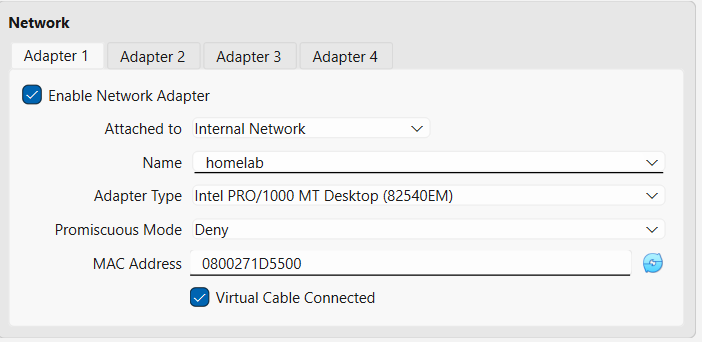
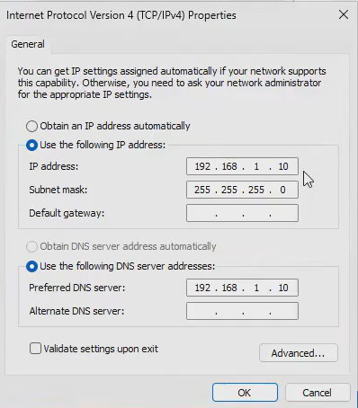
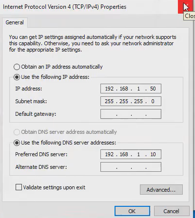

# Windows Active Directory Lab
This lab was conducted as a personal project, and demonstrates IT and help desk skills. The lab goes over multiple actions an administrator can conduct to manage users and groups. If you would like to view the video for this lab, then see: https://www.youtube.com/watch?v=cH_FfaigKJo

# Tools and Tasks
* **VirtualBox**: Contains virtual machines. ISO files downloaded are uploaded in VirtualBox.

* **Windows Server 2025 VM**: Administrator work takes place in this VM

* **Windows 10 Client VM**: Users log into this VM

* **Server Manager and Active Directory**: Allow admins to create and manage **organizational units**, **groups**, and **users** among other use cases.

* **Folder sharing**: Sharing through file explorer and **Group Policy Management**

* **Account Lockout Policy**: Set how long an account lockout is and how many invalid attempts trigger it. This is set in **Group Policy Management**

* **Password reset**: Reset password if users forget it

# Connection of the VMs
An important part of this lab setup is to setup a communication channel so that the server and client VMs can communicate with each other.

As shown below, for this lab, I set both VMs in VirtualBox settings to **Internal Network** and for the name, I chose **homelab**.

In the Windows Server VM's Control Panel, these are my IPv4 properties.

In the Windows client VM's Control Panel, these are my IPv4 properties.
