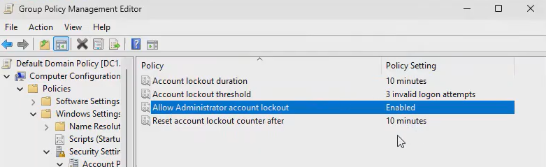

# Account Lockout Policy Directions
**Video Link**: https://youtu.be/cH_FfaigKJo?si=3xmvJm28j6NdNxA_&t=1629

1. In Group Policy Management, right click on **Default Domain Policy**, then click on **Edit...**.

2. Go to `Computer Configuration/Policies/Windows Settings/Security Settings/Account Policies/Account Lockout Policy`. Here you can set the account lockout duration and account lockout threshold.

