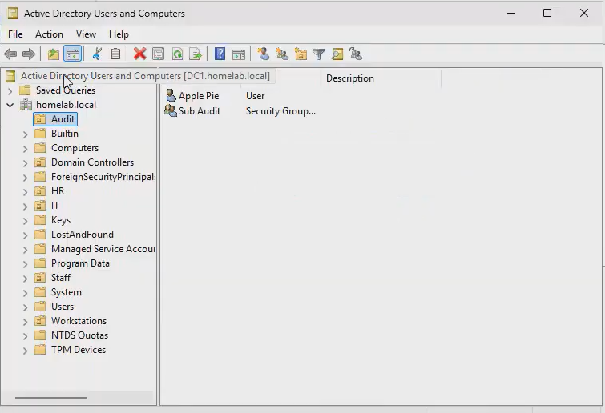

# Adding Items Directions
**Video Link**: https://youtu.be/cH_FfaigKJo?si=V7pBr7V1b3hCPlG_&t=293

In the server VM, go to Server Manager and click on **Tools**, and then click on **Active Directory Users and Computers**. You will be in a page like this: 

  

In order to create an organizational unit, right-click **homelab.local** or what you used to name it. Then select **New**, then select **Organizational Unit**. Type in the name of the organizational unit you want to create.

In order to create a group, right-click the OU you created, select **New** and then **Group**. Then select the **Group name**. You can leave the other settings at its default.

In order to create a user, right-click the OU you created, select **New** and then **User**. Enter in the first and last names and the user logon name. Then click on **Next**. Create a password. It is strongly recommended to have the user create their own password at next logon. But for the purposes of this lab, let's keep things simple.

To move the user to a group, right click the user, select **Add to a group...**, then enter the name of the group.