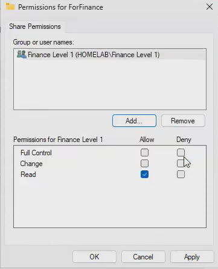
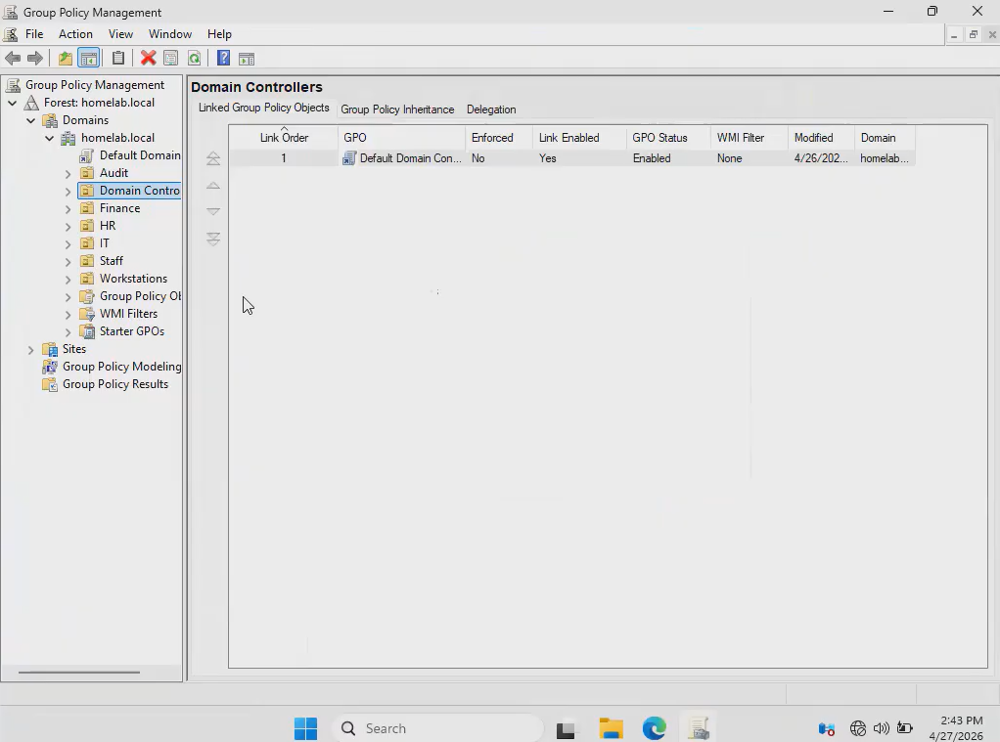
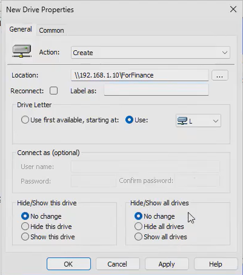

# Folder Sharing Directions
**Video Link**: https://youtu.be/cH_FfaigKJo?si=X0t2oTQSYFfeVvrO&t=754
## Method 1
1. Create the folder in the file explorer. You can add files within the folder.

2. Right click on the folder and click on **Properties**. Then go to **Sharing** tab and click on **Advanced Sharing**. Click on the **Share this folder** checkbox. Then click on **Permissions**. If you want to share to a specific group then remove **Everyone**. And click on **Add**. Then type the name of the group you want to share the folder to.

3. Apply appropriate permissions using least privilege, then click on **Apply**.

4. Then right click on the folder, click on **Properties**, and go to **Security** tab. Then click on **Edit...** and then **Add**. Then type in the group name. Then apply appropriate permissions.

5. Go to the client VM and sign in to a user that is in the group with the shared folder. Do Win + R, and type in `\\192.168.1.10`. The client should be able to access the folder.

## Method 2
1. Go to Group Policy Management.

2. Right click on the OU in question, then click on **Create a GPO in this domain, and Link it here...**. Name the GPO.

3. Right click on the GPO and click **Edit**. Then go to `User Configuration/Preferences/Windows Settings/Drive Maps`. Then right click in the white area and click **New**, then **Mapped Drive**. Then change **Action** to **Create**. For location, enter `\\192.168.1.10\[Folder_name]`. Then assign a drive letter.

4. Go to **Common** tab, and select **Item-level targeting**. Then click on **Targeting...** and click on **New Item** at the top. Select **Security Group** and type in the group you want to share to.

5. The clients in the group should see the folder in the file explorer under the drive letter you assigned. If the client does not see it, do `gpupdate /force` in client's Command Prompt.