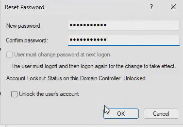

# Password Reset Directions
**Video Link**: https://youtu.be/cH_FfaigKJo?si=t-ixK-8VQXqt1wuq&t=1890
1. Go to Server Manager. At the top right, click on **Tools**. Then select **Active Directory Users and Computers**. Right click on the user you would like to reset the password for.

2. Click on **Reset Password...**. Then enter in the new password. In a real world scenario, it is strongly recommended to let the user create their own password at next logon.

